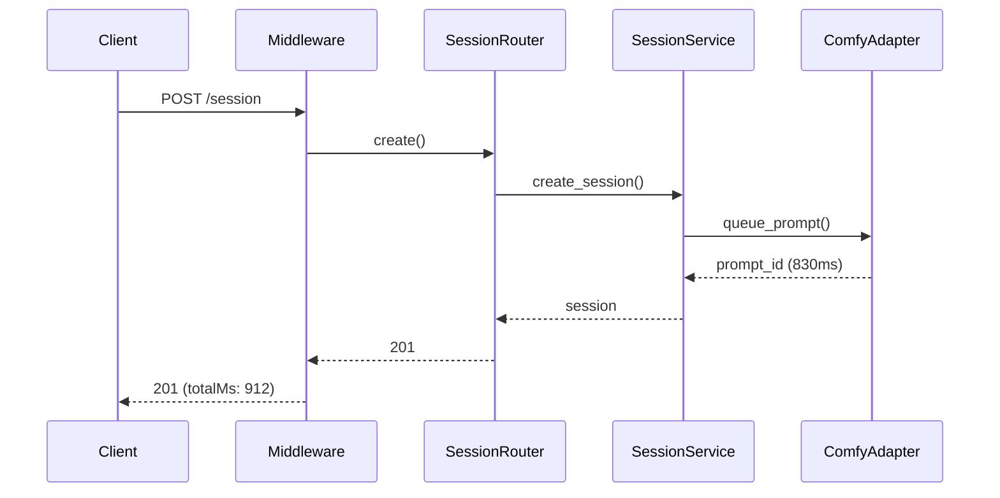

# trace-fastapi-request

## When to invoke

- Need to understand an unfamiliar endpoint's or WS handler's call graph.
- Performance investigation: which layer adds latency?
- Reviewing a PR that touches many layers and want to see the full path.

## Workflow

### 1. Pin a correlation id and take the BEFORE baseline

Pick a fresh id and confirm it has no evidence yet — this is what makes the AFTER read meaningful:

```bash
TASK=trace-create-session
find .logs/agent -name "$TASK*.log" | wc -l   # must be 0
```

### 2. Send the request with the id

HTTP — header:

```bash
curl -H "x-agent-task-id: $TASK" -X POST localhost:8000/session -d '{...}'
```

WebSocket — query param (browsers can't set custom WS headers; the `AgentLoggerMiddleware` accepts both):

```bash
npx wscat -c "ws://localhost:8000/live?agent_task_id=$TASK"
```

### 3. Collect the AFTER logs by id

```bash
find .logs/agent -name "$TASK*.log" -mtime -1 \
  | xargs cat \
  | jq -c '{ts, scope, msg, durationMs: .ctx.durationMs}'
```

### 4. Reconstruct order

Sort by `ts`. Expected sequence (with proper `log()` calls at each boundary):

```
http.request          (middleware entry)          — or ws.request
router.<name>         (route handler)
service.<name>        (application layer)
adapter.<name>        (external call: DB, HTTP client, queue, GPU)
adapter.<name>        (N+1 if repeated)
service.return
http.response         (middleware exit, durationMs) — or ws.response
```

### 5. Produce diagram



### 6. Identify bottlenecks

Sort spans by `durationMs`. The top 1-3 are candidates for optimization. In async code, a
span that blocks the loop (sync call inside `async def`) inflates EVERY concurrent request —
check whether unrelated requests slow down together.

## Failure modes

- Logging is too coarse (only middleware) → can't see service/adapter layers. Fix by adding `log("service.<name>", ...)` calls at each boundary — the helper is importable anywhere, taskId travels via contextvars.
- Same `taskId` reused across requests → noise; use a fresh id per investigation (that's why step 1 asserts the baseline is empty).
- WS events logged as `http.request` + 404 → uvicorn lacks WS support; install `uvicorn[standard]`.
- Middleware not registered → no logs at all; apply `expose-hidden-logs` first.

## Verification

- A diagram (Mermaid) produced and pasted in the plan, ADR, or PR description.
- Span list with durations exported to `.logs/agent/.../<task-id>.summary.md`.
