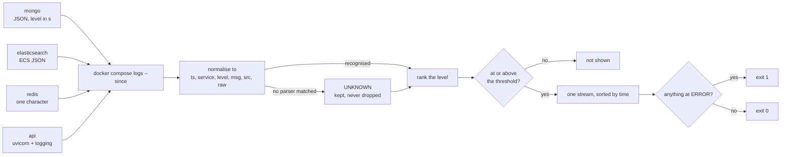
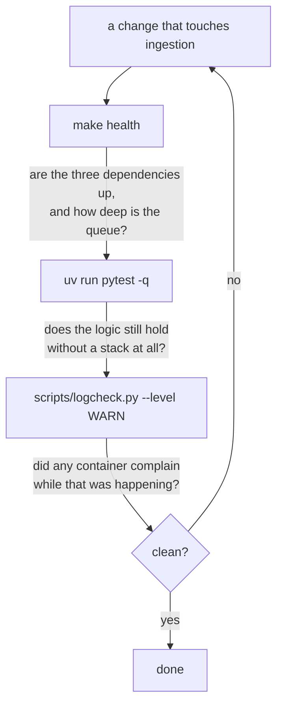

# Architecture

A distributed event processing platform: asynchronous ingestion of high-volume web
events, backed by MongoDB, Elasticsearch and Redis.

Every claim in this document was verified by running the system, not by reasoning about
it. Where a number appears — a pool size, a query plan, a delivery count — it came from
executing something, and the document says what.

---

## 1. System diagram

```
                    ┌──────────── one Python process ("in-process") ───────────┐
                    │                                                          │
  ┌────────┐  POST  │  ┌─────────┐  send()  ┌────────────┐ receive() ┌───────┐ │
  │ Client │───────►│  │ FastAPI │─────────►│ EventQueue │──────────►│Worker │ │
  └────────┘  202   │  └─────────┘          │  (in RAM)  │◄──────────│  × 8  │ │
                    │       ▲               └────────────┘  delete() └───┬───┘ │
                    │       │                                            │     │
                    └───────┼────────────────────────────────────────────┼─────┘
                            │                                            │
                            │                        1. upsert ┌─────────┴──────┐ 2. index
                            │                                  ▼                ▼
                            │                         ┌─────────────┐   ┌───────────────┐
                            │                         │   MongoDB   │   │ Elasticsearch │
                            │                         │source of    │   │   derived     │
                            │                         │   truth     │   │    index      │
                            │                         └──────┬──────┘   └───────┬───────┘
                            │                                │                  │
   READ PATHS               │                                │                  │
                            │                                │                  │
                            ├──► GET /events ────────────────┤                  │
                            ├──► GET /events/stats ──────────┘                  │
                            │                                                   │
                            ├──► GET /events/search ────────────────────────────┤
                            ├──► GET /events/search/terms ──────────────────────┘
                            │
                            └──► GET /events/stats/realtime ──►  Redis  ──(miss)──►  the same aggregation
```

The dashed boundary matters more than the boxes. Four containers run, but the API, the
queue and the worker share **one Python process**. The queue is not a service — it is
`app.state.queue`, a variable in that process's memory.

**Write path.** `POST /events` validates, stamps an `event_id`, enqueues, and returns
`202 Accepted`. It never touches a database. A worker task picks the event up, writes
MongoDB first, then Elasticsearch, then deletes the message from the queue.

**Read path.** Each endpoint goes to the store that can answer it, and **only
`/events/stats/realtime` passes through the cache** — the other reads reach MongoDB or
Elasticsearch directly. An earlier version of this drawing routed every read through the
Redis box and patched it with an annotation, which is a diagram arguing against its own
caching table in §3.

---

## 2. Component responsibilities

| Component | Owns | Explicitly does *not* own |
|---|---|---|
| **FastAPI layer** | Validation, `event_id` assignment, enqueueing, backpressure (`429`) | Any database write. It cannot corrupt state because it never writes state |
| **EventQueue** | Delivery semantics: visibility timeout, delivery counting, backoff, dead-letter routing | Business logic. It moves opaque events |
| **Worker** | Two writes, in order, then the ack | Retry logic. There is no `except` that retries — see §4 |
| **MongoDB** | The source of truth. Filters and aggregations | Full-text search |
| **Elasticsearch** | Full-text over the type, the user, `metadata` and the URL. A derived index | Being authoritative. It can be rebuilt from MongoDB at any time |
| **Redis** | One cached aggregation, with a TTL | Durability. It runs with persistence deliberately off |

### Why the `event_id` is assigned in the API layer

The assignment site is the design, not a detail:

```
API assigns id → enqueue → worker      a redelivery carries the SAME id     ✅
API enqueues → worker assigns id       every redelivery invents a NEW id    ❌
```

The queue is at-least-once, so a message can be delivered more than once. If the id were
generated in the worker, each redelivery would look like a distinct event and the unique
index would deduplicate nothing. Because the id is stamped once, before the queue, every
redelivery of that message upserts the same document.

The same reasoning applies to `timestamp`. When a client omits it, the API stamps
`now()` — safe, because it is fixed once before the queue. The same `now()` **inside the
worker** would silently break the system; see §5.

### Why `202`, not `201`

When the API responds, the event is in the queue, not in MongoDB. A `201 Created` would
assert a resource that does not exist yet. The API promises *"I received this"*, never
*"I stored this"*, and the status code says exactly that.

---

## 3. Storage rationale

### Why three stores and not one

MongoDB can store JSON with flexible keys. Elasticsearch can store documents. Redis can
hold a counter. Any one of them could technically hold everything — so the split has to
justify itself.

It does, on **read cost asymmetry**. This system writes each event once and reads it
many times, in three shapes that have nothing in common:

| Read shape | Cheap in | Expensive in |
|---|---|---|
| Filter by exact field + time range | MongoDB (B-tree index) | Elasticsearch (wrong tool, more moving parts) |
| Full-text over arbitrary nested keys | Elasticsearch (inverted index) | MongoDB (collection scan, or an index per unknown key) |
| Repeated identical aggregation | Redis (in-memory read) | Both (recompute every call) |

Full-text search over the source of truth is precisely what Elasticsearch exists to
avoid.

### The hierarchy is the important part

These are not three equivalent databases. Their **ranking** is what makes the system
reasonable to operate:

```
MongoDB        source of truth      losing it is real data loss
Elasticsearch  derived index        losing it is lag — rebuild from MongoDB
Redis          cache                losing it is nothing — it refills itself
```

The vocabulary is deliberate: Elasticsearch is a **projection**, never a "replica". The
word carries the guarantee. Because it is derived, a failed write to it is not corruption
— which is what makes §4 tractable without distributed transactions.

### Indexing

**MongoDB.** Indexes follow the actual query patterns, ordered by the ESR rule —
equality first, then range/sort. Reversed, MongoDB scans the whole range and filters
afterwards.

| Index | Serves | Notes |
|---|---|---|
| `_id` (= `event_id`) | Idempotency | The most important index, and it serves no query. Without it the queue's at-least-once delivery duplicates events |
| `{event_type: 1, timestamp: -1}` (`type_time`) | `GET /events` by type, `GET /events/stats` | Equality first |
| `{user_id: 1, timestamp: -1}` (`user_time`) | `GET /events` by user | `user_id` is highly selective |
| `{timestamp: -1}` (`time_desc`) | `GET /events/stats/realtime` | The live window filters by time and nothing else. See below — this one was argued *against* first, and the argument was right until the query existed |

Verified rather than assumed — `explain("executionStats")` on a filtered, sorted query:

```
plan       : "stage":"FETCH"  ->  "stage":"IXSCAN"
index      : "indexName":"type_time"
examined   : 200 docs / index keys: 200 / returned: 200
```

A 1:1 key-to-document ratio means no document is fetched and discarded, and there is no
`SORT` stage — the ordering comes free from the index.

**Indexes deliberately not created:**

- `metadata.*` — an open, unknown key space. Indexing it in MongoDB is chasing a moving
  target; that is what Elasticsearch is for. This omission *is* the division of labour
  that justifies running both.
- `source_url` alone — low selectivity. An index returning 30% of a collection costs more
  than the scan it replaces.
- ~~`timestamp` alone~~ — **this one was created later, and the reversal is worth
  recording.** The argument against it was that it is already the suffix of both compound
  indexes and no query filtered on date without another predicate. The first half is true
  and irrelevant: a suffix is not a prefix, so a query leading with `timestamp` cannot use
  either. The second half was true until `/events/stats/realtime` started serving a live
  window, which filters by time and nothing else. A view polling that every two seconds
  was scanning the whole collection — measured at **620 documents examined, 0 index
  keys**. With `time_desc` it examines index keys instead. Every extra index is still a
  slower write on the hot path; this one now buys more than it costs.

**Elasticsearch mapping.** Explicit, because dynamic inference gets the important field
wrong:

| Field | Type | Reasoning |
|---|---|---|
| `event_type` | `keyword` | Not `text`. It is filtered exactly and grouped, and `text` would tokenize it and break aggregations. Search still matches it — as an exact term, which is why it carries the highest boost: an event whose *type* is the word beats one that merely mentions it |
| `timestamp`, `received_at` | `date` | Range queries and date histograms |
| `user_id` | `keyword` | An opaque identifier; analyzing it is meaningless |
| `source_url` | `keyword` + `text` sub-field | Group by exact URL, and search path tokens |
| `metadata` | `flattened` | See below |

**Analyzers.** Only one field is analysed at all, and that is the choice worth explaining.

`event_type` and `user_id` are `keyword`, which means *no* analyzer: the value is indexed
whole. Running an analyzer over `pageview` would buy nothing and break the aggregations
that group by it, and normalisation happens earlier anyway — `event_type` is lowercased at
the HTTP edge (`models.py`), so the index never sees two spellings of one type.

`source_url.text` uses the **standard** analyzer, inherited rather than configured, and it
is worth knowing exactly what that does to a URL:
`https://shop.example.com/product/64` becomes `https`, `shop.example.com`, `product`, `64`.
It splits on `/` but keeps the host together, which is what makes `?q=product` find a path
segment while `?q=shop.example.com` still finds the host. A custom analyzer — a path
hierarchy tokenizer, say — would give prefix matching on `/a/b/c`, and it is not worth the
mapping complexity for a search box whose real subject is `metadata`.

`metadata` is `flattened`, and flattened leaves are keywords: **not analysable, by
definition of the type**. That is the hidden cost of the mapping-explosion fix, and it is
why search inside metadata is term-level rather than stemmed. `firefox` matches, `Firefox`
does not, and neither does a partial word — fuzziness is what covers the gap, deliberately
(see the search section).

`metadata` is the hard field. Under dynamic mapping, arbitrary JSON creates a new field
per new key and the cluster degrades — mapping explosion. `flattened` maps the whole
object as a single field and indexes its leaves as keywords.

**The cost is stated, not hidden:** everything inside `metadata` becomes a keyword.
Numeric range queries, highlighting and type-aware sorting are lost within that subtree,
and Elastic's own documentation warns it is not meant for indexing all document content.
The middle path, once hot keys are known (`metadata.device_type`, `metadata.browser`), is
to map those explicitly and leave `flattened` for the unpredictable tail.

### Caching

Redis sits in front of **one** endpoint — the only one whose contract already admits it
returns a snapshot rather than the truth.

| Endpoint | Cached | Reasoning |
|---|---|---|
| `/events/stats/realtime` | **Yes** | Expensive aggregation, frequently repeated, and the contract promises a lightweight summary — not an exact number |
| `/events/stats` | No | Same aggregation, different promise: here the caller expects the correct value. Serving it from cache changes the contract silently |
| `/events/search` | No | The free-text query space is enormous, so hit rate tends to zero. Elasticsearch already has its own query cache |
| `/events` | No | Arbitrary filter combinations produce a near-unique key per request. Caching what never repeats is pure cost |

**No invalidation. TTL only.** This sounds like a shortcut and is a decision. Precise
invalidation would require knowing which cached entries each incoming event affects —
evaluating every cached key against every write. In a pipeline built for high write
volume, that costs more than the aggregation being avoided.

It is tempting to argue that **the staleness already exists upstream** — ingestion is
asynchronous, so an accepted event is not in MongoDB yet either — and therefore the TTL
introduces no new inconsistency. That argument is weaker than it sounds, and measuring it
says so: from `POST` to visible in MongoDB is **2-48ms**, bimodal because an idle worker
task sleeps 50ms between polls. Note the store that number is about: `/events/search`
takes roughly a second longer, because Elasticsearch's `refresh_interval` is left at its
default of one second. Written and findable are different moments, and quoting only the
first while being this precise about it would read as a claim about both. A 10-second TTL is two to three orders of magnitude larger
than the lag it claims to be a ceiling on. **The cache is the dominant staleness in the
read path**, not a rounding error on top of one that was already there.

The honest argument is narrower, and enough: this endpoint's contract promises a recent
summary rather than an exact figure, so a bounded lag does not break it — and the bound is
chosen to match what the endpoint serves.

Then the endpoint changed, and this section is worth reading as the record of that. It
first served the same hourly aggregation as `/events/stats`, where the current hour is one
bar that grows for sixty minutes: nothing it returned could change visibly while you
watched it, whatever the route was called. Fine bins fixed that and broke the caching — the
bin still filling was snapshotted at its first request, usually near-empty, and served that
way until the key rolled, so a burst spread across seconds appeared to arrive all at once.

The resolution is that **the window ends at the last closed bin**. Every bin returned has
finished, so a cached answer is not an out-of-date view of the present: it is the exact
answer for a window that ended. There is no staleness left to bound. The TTL now governs
only how long a superseded key lingers before Redis drops it, which is why raising
`STATS_CACHE_TTL` changes nothing observable — the key is the bin slot and rolls on its
own every two seconds. The real freshness control is `LIVE_BIN_SECONDS`, and saying
otherwise would be selling a knob that does nothing.

One caveat that the word *exact* has to carry honestly: an event whose timestamp falls in a
bin can still reach MongoDB a few milliseconds after that bin closed, worker lag being
2-48ms. That is two orders of magnitude below the bin, and it is the only way a closed bin
can still gain a straggler.

This is observable rather than asserted:

```
$ curl -s /events/stats/realtime | jq '{since, until, bin_seconds, cached}'
{ "since": "…T04:05:34", "until": "…T04:10:34", "bin_seconds": 2, "cached": true }
```

`until` is always in the past. That is the property, and it is checkable in one call.

### Under higher write volume

The brief asks what would change, and the honest answer is that **the strategy holds and
the numbers stop being free**. Nothing above depends on the write rate: the key is a time
slot, the value is immutable once its bin closes, and no write ever has to invalidate
anything. That is the property worth keeping, and it is why TTL-only survives volume that
would make precise invalidation collapse.

Three things change.

**The miss gets expensive.** The aggregation scans the window, so its cost grows with
events-per-window, not with total events. At ten times the rate a miss costs ten times as
much, and the miss rate is fixed by the bin, not by traffic — one recompute every two
seconds regardless. The fix is not a longer TTL, which buys nothing here; it is to stop
recomputing history that cannot change. Only the newest bin is ever new, so the natural
next step is an incremental counter per bin, written on ingest, and a read that sums bins
instead of scanning documents.

**Stampede stops being theoretical.** One key expiring under a hundred concurrent readers
sends a hundred identical aggregations at MongoDB. At this volume it does not matter; at
ten times it does, and the answer is a single-flight lock or a probabilistic early
refresh, not a bigger cache.

**Redis stops being free to lose.** Today losing it costs one recompute. With counters
written on ingest it would hold state that is expensive to rebuild, which changes its tier
in §3's hierarchy from *disposable* to *derived* — and a rebuild path from MongoDB becomes
mandatory, exactly as `scripts/reindex.py` is for Elasticsearch.

Note what does **not** change: the contract. The endpoint promises a recent summary, so
none of the above requires telling callers anything new.

---

## 4. Queue design and delivery guarantees

The assignment asks the queue to be in-process and modelled on SQS. The port exposes
SQS's verbs deliberately, so that migrating to a real broker is one adapter rather than a
rewrite:

```
send(event)                         → SendMessage
receive(max_n, visibility_timeout)  → ReceiveMessage
delete(receipt_handle)              → DeleteMessage            ← this IS the ack
change_visibility(handle, seconds)  → ChangeMessageVisibility  ← heartbeat
```

### The state machine

```
   VISIBLE ──receive()──► INVISIBLE ──delete()──────────► (gone)
      ▲                       │
      │                       ├──visibility timeout──────► VISIBLE  (receive_count += 1)
      └───────────────────────┤
                              └──receive_count ≥ max────► DEAD-LETTER QUEUE
```

The single idea worth carrying: **a retry is the absence of a delete, not an action.** A
message is not handed over, it is *lent*. If the worker dies, nobody deletes anything,
the deadline lapses and the message returns on its own. This is why there is no retry
logic in the worker — all of it lives in the queue.

### Guarantees

| Guarantee | Value | Consequence |
|---|---|---|
| Delivery | **At-least-once** | Duplicates are normal, not an error. Every write must be idempotent |
| Ordering | **None** | See §5 — the system does not need it |
| Durability | **None. At-most-once across a restart** | The queue is process memory. This is the honest cost of "in-process" |

### Backoff and the dead-letter queue are the same mechanism

The assignment requires retries with backoff. Rather than building a second mechanism,
the visibility timeout *grows*:

```python
delay = min(base * 2 ** (receive_count - 1), CAP)
```

A failing message becomes invisible for longer on each attempt until `receive_count`
exceeds the maximum, at which point it is routed to the dead-letter queue instead of back
to visible. One mechanism covers retries, backoff and the DLQ. **That is not how SQS does it**, and
the difference matters for the migration story in this same section.

SQS's visibility timeout does not grow with the receive count: it is fixed per queue or
per message, and a consumer that wants backoff calls `ChangeMessageVisibility` itself. The
redrive policy gives `maxReceiveCount` → DLQ, so half of this mechanism transfers and half
does not. A real `SQSEventQueue` adapter cannot reproduce the growing timeout server-side,
so the backoff would have to move into the worker — the exact layer this design forbids
from holding retry logic. The port speaks SQS's vocabulary faithfully; on this one point
it does not speak its semantics, and "the application changes in exactly one place" is
true of everything except this.

The growing timeout also conflates two different things: how long a consumer is allowed to
process a message, and how long to wait before trying again. A message on its fifth
attempt that fails in five seconds still sits invisible for the remaining 475.

### On deduplication

The brief lists "event deduplication logic in the worker" as a bonus. There is
deduplication, and it is deliberately **not** in the worker: it is the unique `_id` on the
MongoDB collection, applied through an upsert.

Putting it in the worker would mean checking for existence before writing — a read plus a
write, with a race between them, and no guarantee under concurrency. The unique index
enforces the same property atomically, at the only place that can actually guarantee it,
and it costs nothing extra because the write was already an upsert. The worker stays free
of the concern entirely.

### These semantics were observed, not read

The design came from running **ElasticMQ 1.7.1**, an SQS-compatible server, and watching
the states. That surfaced a detail prose descriptions omit:

```
-> DeleteMessage(stale_handle):   REJECTED: ReceiptHandleIsInvalid
```

The receipt handle belongs to the **delivery, not the message** — it is regenerated on
every redelivery. This closes a real race: worker A stalls, the message is redelivered to
B, B completes it, and *then* A revives and issues its delete. Without handle
invalidation, A would delete work that was no longer its own. The in-memory
implementation reproduces this, and a test asserts it.

### What would change with real SQS

The `EventQueue` port already speaks SQS's vocabulary, so the migration is one adapter.
What changes is not the code but the guarantees:

| Concern | Today (in-process) | With SQS |
|---|---|---|
| Durability | Lost on restart | Survives; replicated |
| Consumers | One process | Any number of processes or machines |
| Visibility timeout | A `dict` of deadlines | Server-side |
| DLQ | A list in memory | A real queue with a redrive policy |
| Ordering | None | None (Standard) or per `MessageGroupId` (FIFO) |
| Latency | A pointer dereference | A network round trip (~20–100 ms) |
| Failure mode | Process death loses everything | Network partition, throttling, cost |

The application changes in exactly one place: which adapter is constructed at startup.
`receive()` would gain long polling, and `delete()` would batch.

---

## 5. Concurrency, and why it is safe

The worker runs **8 concurrent consumers** by default, over one shared queue.

The work is I/O-bound — the worker computes nothing, it awaits two network calls. During
those awaits the event loop is free, so eight tasks mean eight events in flight on a
single CPU. Concurrency, not parallelism.

The number is anchored, not chosen: pymongo's default `maxPoolSize` is **100** (verified
against the installed library, pymongo 4.17.0). With 200 consumers, 100 would simply wait
for a connection — the ceiling is downstream, not in the queue.

### Why more than one consumer, beyond throughput

With a single consumer, at-least-once delivery almost never manifests, idempotency is
never exercised and ordering never breaks. A submission can ship without the unique index
and *appear* to work. Concurrency forces the design to be correct.

### The scaling strategy is commutativity, not coordination

Concurrent consumers process events out of order. That is not fixed — it is made
irrelevant. Three properties make coordination unnecessary:

| Property | Achieved by | Buys |
|---|---|---|
| **Idempotency** | Unique `event_id` + upsert | Processing twice equals processing once |
| **Commutativity** | The `timestamp` travels *inside* the event | A→B leaves the same final state as B→A |
| **No shared state** | Each event is processed on its own | No consumer needs to know about another |

With all three, N consumers are N× throughput with zero synchronisation. Out-of-order
**writes are invisible to every read**, because `/events/stats` groups by the document's
`timestamp` field, not by insertion order.

So the system declares **no ordering guarantee** — and the justification is not "it was
free" but "it is not needed, because the event's own timestamp makes write order
irrelevant to every read."

### The trap

```python
doc = {..., "timestamp": datetime.now(UTC)}   # WRONG — inside the worker
doc = {..., "timestamp": event.timestamp}     # right
```

With `now()` in the worker, an event's recorded time depends on which of the eight
consumers won the race — that is, on the scheduler. Two events seconds apart can be
recorded inverted, and hourly statistics come out wrong.

It is insidious because **it never fails with one consumer**. It appears only under
concurrency and load.

### The hard boundary: `uvicorn --workers`

Scaling the *process* count breaks the model outright. Each uvicorn worker is a separate
OS process with its own `app.state` and therefore **its own queue**:

```
uvicorn --workers 4
├── process A → queue (empty)
├── process B → queue [evt-1, evt-2]
├── process C → queue (empty)
└── process D → queue [evt-3]
```

A `POST` landing on B enqueues in B; C's consumers never see it. No error is raised —
there are simply four independent queues, four DLQs and four sets of counters.

**"In-process queue" and "horizontal scaling" are mutually exclusive, and the boundary is
the process.** The moment a second process is needed, the queue must move somewhere both
can see.

---

## 6. Failure modes

| Component down | Ingestion | Reads | Data loss? | Recovery |
|---|---|---|---|---|
| **MongoDB** | Accepts | Degraded | No, if it returns in time | The worker never reaches its `delete`; the message returns by timeout with growing backoff. The queue grows. After the retry limit, the DLQ |
| **Elasticsearch** | Accepts | No search | **No** | MongoDB holds everything. Full reindex from the source of truth |
| **Redis** | Accepts | Slower | No | Automatic. Every request hits the origin and the cache refills. This is why it runs without persistence |
| **Worker** | Accepts | Stale data | **Yes — everything queued** | The queue is process memory |
| **The API** | Down | Down | **Yes — everything queued** | Same process as the worker; it takes the queue with it |

The last two rows are the same row, and that is the honest cost of the design.

**How long is "in time"?** Nobody had put a number on it. With the defaults the retry
budget is 30 + 60 + 120 + 240 + 480 = **930 seconds**, so an outage past roughly **15
minutes** routes everything accepted during it to the dead-letter queue. Two things make
that worse than it sounds: dead-lettering frees the entry it came from, so the queue never
fills and the `429` backpressure never fires — the API keeps answering 202 for events
marching into the pit — and the dead-letter is process memory, so a restart takes them.
The mitigation available today is the log: every dead-lettered event is written whole at
ERROR, which is the only durable record an in-process queue can offer.

### If the worker crashes mid-batch

Less dramatic than it sounds, because the `delete` is per message rather than per batch.
Already-acknowledged messages are not reprocessed; everything not yet acknowledged
returns intact. **A half-finished batch does not leave the system half-finished** — it
leaves messages that were never acknowledged, which is a state the queue already knows how
to handle.

### Graceful degradation

- `/health` returns `503` when any dependency is down, so an orchestrator stops routing
  traffic instead of a load balancer discovering it.
- A failure creating indexes at startup **does not prevent startup**. The app serves
  degraded and the health check reflects it; dying there would turn a performance problem
  into an outage.
- A Redis failure never propagates to the caller. `StatsCache.get()` catches, returns
  `None`, and the value is recomputed. The cache is an optimisation, not a dependency.
- The queue is **bounded**. When full, the API returns `429` rather than accepting work it
  cannot hold. Rejecting is honest; accepting and dying later is not.
- Shutdown drains in-flight work, and if events remain it says so:
  `WARNING  losing {'visible': 12, 'in_flight': 3} queued events on shutdown`.

A system that does not admit its loss window has not eliminated it — it has hidden it.

### The dual write

The worker performs two writes with no transaction between them. If MongoDB succeeds and
Elasticsearch fails, the system is divergent: the event exists but cannot be found.

The assignment never mentions this, which is why it deserves an explicit answer.

**Order is fixed: MongoDB first, always.** Reversed, a failure would leave a searchable
document that does not exist — a phantom result, worse than a missing one.

**The resolution costs zero extra code.** The worker does not catch to retry; on failure
it simply never reaches the `delete`, so the message returns by timeout and the whole
unit is retried. Re-writing MongoDB is harmless *only because* the upsert is idempotent —
the two decisions hold each other up.

The known limit, stated rather than hidden: between the failure and the retry, MongoDB
holds an event Elasticsearch cannot find.

That window is **not** bounded by the visibility timeout, which an earlier version of this
paragraph claimed. It is bounded by the backoff, which grows: 30s, 60s, 120s, 240s, 480s
with the defaults, so the last gap is sixteen times the first. And two cases are not
bounded at all — if the retries are exhausted the message dead-letters and the divergence
is permanent until somebody runs `scripts/reindex.py`; if the process dies between the two
writes, the message goes with the queue and no retry ever happens.

Worse, nothing detects it. `/health` pings both stores but never compares them, so the
first signal is a user reporting a missing search result. A count comparison on a timer is
the cheap version and it is not here — see §8.

---

## 7. Scaling considerations

If event volume grew 10×, this is what breaks, in order. **The first thing is not a
database.**

| # | Breaks | Why | Response |
|---|---|---|---|
| **1** | **The in-memory queue** | If events arrive faster than the worker drains, nothing pushes back. It grows until the process runs out of memory and takes everything queued with it | Already bounded with a `429`. Next: move the queue out of the process |
| 2 | Single-document writes to Elasticsearch | One `index` call per event is the classic ES mistake. Per-request overhead dominates long before the cluster saturates | Bulk API, flushing on size or time |
| 3 | Consumer concurrency | Raising N stops paying once it hits the connection pool (100). Beyond that, tasks queue on connections instead | Raise the pool alongside N. Then the queue must leave the process |
| 4 | MongoDB writes | Only here does a database appear. The first limit is not disk — it is the indexes, updated on every insert | Bulk writes; then sharding by `user_id`, or time-windowed collections |
| 5 | The cache, on expiry | Cache stampede: 10× traffic against a key that expires means 10× concurrent recomputation of the same aggregation | Stale-while-revalidate with a lock, or proactive refresh before expiry |

That the queue breaks first **is not an accident of the design — it is the design.**
Keeping it in-process bought simplicity, and this is precisely what was paid for it.

### One weakness the list above does not cover

`GET /events` paginates with `skip`/`limit`, and **`skip` is O(n)**: MongoDB walks and
discards every skipped document. It is fine for the first few pages and degrades linearly
after that — at offset 100,000 the database does 100,000 units of work to return 50 rows.

It is not in the ordered list because it does not break under *volume*; it breaks under
*deep pagination*, which is a different axis. The fix is range-based pagination — carry
the last seen `timestamp` and `_id` as a cursor and use `$lt` instead of `skip`. That uses
the same compound index and is constant-cost per page. It was not built because nothing in
the brief exercises deep pagination, but it would be the first read-path change I made.

### The number that tells you where you are

Queue depth, exposed on `/health`:

| Depth | Meaning | Action |
|---|---|---|
| Stable near 0 | The worker outpaces ingestion | Nothing. If latency is high, the API is the bottleneck |
| Growing steadily | The worker is the bottleneck | Raise concurrency, then batch |
| Growing with high N *and* batching | Out of headroom in-process | Move the queue out |

### Where the queue would go

| If the reason is… | Destination | Free | Cost |
|---|---|---|---|
| **More than one consumer process** | Redis Streams | The pending-entries list *is* the in-flight table; `XAUTOCLAIM` by idle time *is* the visibility timeout | No new infrastructure — Redis is already here. But its durability depends on fsync, and it currently runs without persistence: it would need separating from the cache |
| **Events cannot be lost** | NATS JetStream | `AckWait`, `MaxDeliver` and DLQ are native; file-backed with Raft | One more container, a smaller ecosystem |
| **Already on AWS** | SQS | Everything. It is the original | Vendor lock-in, per-operation network latency |
| — | Kafka | Replay of the past, which no queue offers | **It is a log, not a queue.** No per-message ack: one poison event stalls an entire partition. Queue semantics arrived in 4.2 (Feb 2026) via share groups, but it remains the wrong shape for this problem |

---

## 7b. Observability

Three surfaces, each for a different reader.

**`GET /health`** — for an orchestrator, and the one number that matters: queue depth.
Stable near zero means the worker outpaces ingestion; growing means it does not. It also
reports `processed`/`failed` counters and dependency status, and returns `503` when any
dependency is down so traffic stops being routed before a load balancer notices.

**Structured NDJSON** under `.logs/agent/<date>/<task-id>.log`, one line per request with
`{ts, level, scope, taskId, msg, ctx}`. Correlation works on two levels: the transport id
from `x-agent-task-id`, and the domain's own `event_id` recorded in context — the latter
being the one that survives every hop, from the API through the queue and the worker into
both stores.

The logging path **cannot fail a request**. `_logger_for` returns `None` and warns once
when the sink is unwritable, and the middleware carries on. This is not defensive
programming for its own sake: the first time the sink was wired onto a bind mount with a
uid mismatch, every response became a `500`. Observability that can take the system down
is worse than none, and the same principle already governs the cache.

The sharper version of the same lesson came from a bug in this file. A generated
per-request id is not a task, but the first implementation gave each one its own log file
and cached the handler forever — one open file descriptor per request, never released.
The container's limit is 1024, so after roughly a thousand requests the process could no
longer accept connections at all. It presented as random `502`s from the dev proxy, as
dropped connections when talking to the API directly, and as an intermittently failing
test: symptoms spread across three layers, none of which was the cause. Generated ids now
share one sink, only an explicit `x-agent-task-id` earns a file of its own, and the map of
sinks is bounded and closes what it evicts. Verified: file descriptors held steady at ten
across two thousand requests, where before the same load exhausted them.

The instrumentation added to find problems was the problem. That is worth stating plainly
in a document about failure modes.

### The log harness

Four containers log in four dialects, and none of them agree:

| Service | Format | Where the level lives |
|---|---|---|
| `mongo` | JSON | `s`, one letter: `F E W I D` |
| `elasticsearch` | ECS JSON | `log.level`, a word |
| `redis` | plain text | one character: `#` warn, `*` notice, `-` verbose, `.` debug |
| `api` | two at once | uvicorn's `INFO:  …` and Python `logging` |

Reviewing an incident by hand means reading four grammars and correlating timestamps at
three different precisions. `scripts/logcheck.py` normalises them into one record and one
clock:



Two decisions in there are the whole value of the thing.

**`UNKNOWN` ranks above `WARN`.** A line no parser recognised cannot be declared harmless,
and a Python traceback lands exactly there — its first line matches nothing. Ranking it
below `WARN` would hide the only class of output that is guaranteed to be interesting.
This is not hypothetical: it is how a MongoDB index-creation conflict surfaced after an
index was renamed, in a run where every other line was clean.

**Nothing is discarded.** An unparseable line is kept with its raw text rather than
dropped, because discarding what you do not understand is how a harness lies to you.

The exit code makes it usable as a gate rather than only as a reader: non-zero when
anything reached `ERROR`.

### The closing gate

Three commands, each answering a different question, and none of them substitutes for
another. `CLAUDE.md` states them as the condition for calling any change to ingestion
done:



The third is the one that is easy to skip and the one that pays. Tests assert what they
were written to assert; the harness reports what the system said while nobody was asking.
Both of the observability bugs described above — the permission failure that turned every
response into a `500`, and the file-descriptor exhaustion — were found by reading logs, not
by a failing test.

**A console** at `:5173`, described in the README. It consumes only public
endpoints — deliberately, because a debug endpoint that exposes queue internals is exactly
what §6's failure analysis says must not exist. Two of them exist *because* of the
console, `POST /demo/reset` and `GET /events/search/terms`, and the README names both:
a UI that grows the public API surface is a real cost, and an uncounted one is worse.

## 8. What I would do differently

**Eliminate the dual write with change data capture.** The strongest available answer to
§6. Instead of writing twice, write only to MongoDB and let a consumer watch the change
stream and project into Elasticsearch. Divergence becomes structurally impossible rather
than handled, and the resume token provides durability that would otherwise have to be
built. The cost is real and specific: change streams require a replica set or sharded
cluster — a standalone `mongod` is not supported — so the compose file would need
rebuilding, and the resume token needs durable storage. That is why it is written here
rather than shipped.

**Move the queue to Redis Streams.** The port exists precisely so this is one adapter.
The honest reason it was not written: the assignment specifies an in-process queue, and
building the second adapter would prove the seam at the cost of contradicting the brief.

**Batch the writes.** Bulk operations to both stores would yield more throughput than
raising consumer count, and are less code.

**Make the timestamp contract explicit.** Client-supplied timestamps are trusted today. In
production they need clock-skew tolerance, a rejection policy for events far in the
future, and a decision about `received_at` versus `timestamp` for the definition of
"recent".

**Client-supplied idempotency keys.** The `event_id` is generated server-side, which
covers redelivery *inside* this system but not a client's own retry. An `Idempotency-Key`
header would make idempotency end-to-end. It was not built because it extends the API
beyond what the brief specifies.

**Instrument beyond queue depth.** Depth is the single most informative number, but
per-stage latency (`received_at` → written) and DLQ rate deserve real metrics rather than
a health endpoint.

**Authentication and rate limiting.** The API is open. Both are listed as bonuses in the
brief and both were consciously skipped in favour of the reasoning above.

---

## Appendix: environment notes

Two environment defects surfaced only by running the system, and both are worth recording
because static validation cannot find them.

**MongoDB will not start on this kernel without a workaround.** MongoDB 8.0+ crashes on
Linux kernels 6.19 through 7.0.13 — the vendored tcmalloc violates the `rseq` ABI
([SERVER-121912](https://jira.mongodb.org/browse/SERVER-121912)). MongoDB has published no
fix; the official resolution is kernel 7.0.14 or later. The compose file sets
`GLIBC_TUNABLES=glibc.pthread.rseq=1` as a workaround, and MongoDB confirms the condition
in its own log output. **If the reviewer's kernel is in that range, this is why the
setting is there.**

**The Elasticsearch client needs the `[async]` extra.** Without it, imports resolve
cleanly and the application fails at startup with
`You must have 'aiohttp' installed to use AiohttpHttpNode`. A missing extra is invisible
to static analysis.
