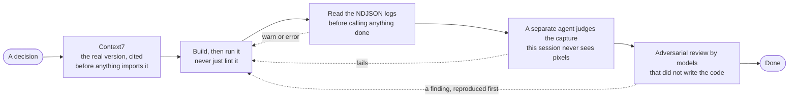

# Distributed Event Processing Platform

Asynchronous ingestion, processing, querying and caching of high-volume web events.
FastAPI, MongoDB, Elasticsearch and Redis, with an in-process queue modelled on SQS.

**The architecture document is [`docs/ARCHITECTURE.md`](./docs/ARCHITECTURE.md)** — it holds the
reasoning behind every decision here, including the ones that were rejected.

---

## Setup

Requires Docker and Docker Compose. Everything else runs in containers.

```bash
make up        # the four backend services, plus the demo console
make health    # the three dependencies, plus queue depth
```

First run pulls roughly 1.5 GB (Elasticsearch is most of it) and takes a few minutes.
The API waits for all three datastores to report healthy before it starts. The fifth
container is the operational console — a demonstration aid that only watches the
backend, not part of the application itself; see [The console](#the-console) and
[`frontend/README.md`](./frontend/README.md).

```bash
curl -X POST localhost:8000/events \
  -H 'Content-Type: application/json' \
  -d '{"event_type":"pageview","user_id":"u-1",
       "source_url":"https://shop.example.com/p/42",
       "metadata":{"browser":"firefox","device":"mobile"}}'

# {"event_id":"2081cdbe69cd437c95cfd188018c0e00","status":"accepted"}
```

Interactive API docs: <http://localhost:8000/docs>

| Command | Does |
|---|---|
| `make up` | Build and start the stack |
| `make down` | Stop containers, keep volumes |
| `make clean` | Stop and **delete** volumes |
| `make health` | Formatted `/health` |
| `make logs` | Follow the API logs |
| `make lint` | `ruff check` + format check |

### Configuration

`.env` holds host ports and the Elasticsearch heap. Everything else has a working
default in [`app/config.py`](./app/config.py). The settings worth knowing:

| Setting | Default | Why it is that |
|---|---|---|
| `WORKER_CONCURRENCY` | `8` | The work is I/O-bound. The ceiling is downstream: pymongo's pool is 100 |
| `VISIBILITY_TIMEOUT` | `30.0` | The **processing window**: how long a consumer may hold a message. It also anchors the retry backoff, which doubles from it |
| `MAX_RECEIVES` | `5` | Delivery attempts before a message is dead-lettered. With the backoff above that is a 930-second budget: 30 + 60 + 120 + 240 + 480 |
| `QUEUE_MAXSIZE` | `10000` | Bounded on purpose. When full the API returns `429` |
| `STATS_CACHE_TTL` | `10` | How long a superseded live summary lingers in Redis. Not a staleness ceiling: the key is the bin slot and only closed bins are returned, so a cached entry is exact for the window it describes |
| `RATE_LIMIT_WRITES` | `2000` | Per client, per window. Sized against `QUEUE_MAXSIZE`, not guessed — see below |
| `RATE_LIMIT_READS` | `3000` | Larger, and separate. The console legitimately polls at 40 req/s while tracing |
| `RATE_LIMIT_TRUST_FORWARDED_FOR` | `false` | Off until a proxy that overwrites the header is actually in front |

### If MongoDB will not start

MongoDB 8.0+ crashes on Linux kernels **6.19 through 7.0.13** — the vendored tcmalloc
violates the `rseq` ABI ([SERVER-121912](https://jira.mongodb.org/browse/SERVER-121912)).
It is not a configuration error and MongoDB has published no fix; the official resolution
is kernel 7.0.14 or later.

`docker-compose.yml` sets a workaround:

```yaml
environment:
  GLIBC_TUNABLES: glibc.pthread.rseq=1
```

Harmless on unaffected kernels. If your kernel is outside that range you can remove it.

---

## Endpoints

### `POST /events`

Validates an event, assigns it an `event_id`, enqueues it, and returns immediately.
**No database is touched on this path.**

```jsonc
{
  "event_type": "pageview",              // required, normalised to lowercase
  "user_id": "u-42",                     // required
  "source_url": "https://shop.example.com/p/9",  // required, must be a valid URL
  "timestamp": "2026-08-30T22:00:00Z",   // optional — stamped by the API if omitted
  "metadata": {"browser": "firefox"}     // optional, arbitrary JSON
}
```

| Status | Meaning |
|---|---|
| `202 Accepted` | Queued. **Not** `201` — the event is not stored yet, and the status code should not claim otherwise |
| `422` | Validation failed. Unknown fields are rejected rather than silently dropped |
| `429` | Refused. Two different defences answer with this status and `X-Throttle-Reason` says which: `queue_full` is backpressure, everyone sees it; `rate_limit` is this caller alone. Both carry `Retry-After` |

Every route except `/health` and the demo controls is rate limited per client, with
separate budgets for writes and reads — see [Rate limiting](#rate-limiting) below.

### `GET /events`

Filters events in MongoDB. Not cached: arbitrary filter combinations produce a
near-unique key per request.

| Parameter | Notes |
|---|---|
| `event_type` | Exact match, normalised |
| `user_id`, `source_url` | Exact match |
| `since`, `until` | ISO-8601, on the event's own `timestamp` |
| `limit` | 1–500, default 50 |
| `offset` | Default 0 |

### `GET /events/stats`

MongoDB aggregation: counts grouped by event type and time bucket.

| Parameter | Notes |
|---|---|
| `bucket` | `hourly` \| `daily` \| `weekly` — default `daily` |
| `since`, `until`, `event_type` | Optional filters |

```jsonc
{"bucket": "hourly", "total": 201,
 "buckets": [{"bucket": "2026-08-30T22:00:00", "event_type": "click", "count": 200}]}
```

### `GET /events/search`

Full-text over `event_type`, `user_id`, `metadata` and the URL path, in
Elasticsearch. **MongoDB does not
participate in this path.**

| Parameter | Notes |
|---|---|
| `q` | Required |
| `limit` | 1–500, default 50 |

Because `metadata` is mapped as `flattened` to avoid mapping explosion, matching within
it is term-level rather than analysed. The trade-off is explained in `ARCHITECTURE.md` §3.

### `GET /events/search/terms`

The values a search box can suggest, from a terms aggregation over the real documents.
Nothing on screen otherwise tells a reader that `webkit-nightly` is a thing this data
contains, and a search box over free-form metadata is unusable without that.

| Parameter | Notes |
|---|---|
| `q` | Optional prefix. Without it, the list opens with the event types, then the most common metadata values |
| `limit` | 1–50, default 12 |

It works *because* `metadata` is `flattened`: the whole object is one field whose leaves
are keywords, so a single terms aggregation returns leaf values across every key at once.
A second aggregation covers `event_type`, which lives in its own field.

Note the division of labour with `GET /events/search`: this is a **prefix** match and the
search is **fuzzy**. Prefixes finish a word you are spelling correctly (`fire` →
`firefox`, which the fuzzy search itself misses at three edits); fuzziness rescues you
when you are not (`firefx`).

The prefix reaches Elasticsearch inside a regex, so it is whitelisted rather than escaped:
`.*` would turn a lookup into a scan and `(` into a 400. Both return an empty list.

### `GET /events/stats/realtime`

A **lightweight stats summary** of recent activity, served from Redis with a configurable
TTL — one dense array of counts per **two-second bin**, per event type, over the last five
minutes, bucketed by each event's own `timestamp`.

It answered with the same hourly aggregation as `/events/stats` at first, and at that
granularity the current hour is a single bar that grows for sixty minutes: nothing it
returned could change visibly while you watched it. Fine bins fixed that and broke
something else — sixty bins across five types as `{bucket, event_type, count}` rows is
roughly 22KB on an endpoint a live view polls every couple of seconds, which is not a
summary.

The weight was in the row objects, not in the numbers. One dense array of integers per
type carries the same breakdown — enough to stack the chart by type — in **1,908 bytes**
for 150 bins across five types, captured from the response below.

The window ends at the last **closed** bin; the one still filling is not returned. That is
what makes the cached answer *exact for its window* rather than a snapshot of a bucket that
was still moving — with the filling bin included, it was captured at its first request,
usually near-empty, and served that way until the key rolled, so a burst spread across
seconds appeared to arrive all at once.

```jsonc
{
  "since": "2026-08-31T04:48:56",
  "until": "2026-08-31T04:53:56",
  "window_seconds": 300,
  "bin_seconds": 2,
  "total": 602,
  "series": [
    { "event_type": "add_to_cart", "total": 120, "counts": [/* 150 ints */ 0, 0, 80, 40, 0, ...] },
    { "event_type": "click",       "total": 120, "counts": [/* 150 ints */ 0, 0, 80, 40, 0, ...] },
    // ... one entry per event type, sorted by name
  ],
  "cached": false,
  "ttl_seconds": 10
}
```

| Parameter | Notes |
|---|---|
| `event_type` | Optional. Restricts the summary to one type; the cache is keyed per type |

`counts` is dense on purpose. The aggregation only finds the bins that hold events; the
gaps are filled server-side, because a client that draws only what comes back renders three
scattered moments as three consecutive ones. `series` is sorted by type name rather than by
volume, so a client assigning colour by position keeps a type's colour between polls.

### Rate limiting

A token bucket per client, in front of writes and reads separately. `/health` and the demo
controls are exempt: rate limiting a liveness probe is how a busy minute becomes a restart
loop.

**The number is derived, not chosen.** `QUEUE_MAXSIZE` is 10,000; at 2,000 writes per ten
seconds one client needs 50 seconds to fill the queue alone, and the worker drains it far
faster. So a full queue means the *aggregate* outran the worker, never one impatient
script — which is the only reading an operator can act on.

**Two defences now answer `429`, and they say opposite things.** `X-Throttle-Reason` keeps
them apart:

| Header | Meaning | What fixes it |
|---|---|---|
| `queue_full` | the pipeline is at capacity, everyone sees it | waiting for the worker |
| `rate_limit` | this caller is asking faster than its share | slowing down |

Both carry `Retry-After`, and the console counts them in separate columns for exactly this
reason. Observed on the running stack:

```
6,000 POST /events at 509 req/s  ->  4,349 x 202,  1,651 x 429 (rate_limit)
```

The console's largest burst — 500 events at 25 concurrent posts — is never throttled, and
that is asserted as a test rather than left to a number that looks comfortable. The full
reasoning, including why the limiter is in-process rather than in Redis, is
[ARCHITECTURE §4b](./docs/ARCHITECTURE.md#4b-rate-limiting).

### `GET /health`

Always `200`; `status` is `ok` or `degraded` and `degraded_by` names what is down. It used
to answer `503` on any dependency failure, which was wrong for this system: with Redis down
every endpoint still works, so a readiness probe would have removed a functioning API, and
a liveness probe would have restarted the process that *holds the queue*. The code answers
the orchestrator — may I send you work? — and the body answers the operator — what is
broken? Also reports **queue depth**,
which is the single most informative number in the system: stable near zero means the
worker outpaces ingestion; growing means the worker is the bottleneck.

```jsonc
{"status": "ok",
 "degraded_by": [],
 "dependencies": {"mongodb": "up", "redis": "up", "elasticsearch": "up"},
 "queue": {"visible": 0, "in_flight": 0, "dlq": 0, "capacity": 10000},
 "worker": {"processed": 201, "failed_attempts": 0, "consumers": 8,
            "paused": false, "resumes_in": 0.0}}
```

`paused` is the worker having stopped pulling because the stores are not answering — see
[ARCHITECTURE §6](./docs/ARCHITECTURE.md#the-dead-letter-queue-used-to-have-false-positives).
A paused worker and an idle one both report zero throughput and only one of them is a
problem, so it is reported rather than inferred, and the console shows it as a pill beside
the queue depth.

---

## The console

`make up` also starts an operational console at <http://localhost:5173>.

**On why a backend submission ships a browser page.** The brief awards no points for
frontend development, and this is not one: there is no product UI here, no user-facing
feature, no styling exercise. It is an **observability surface** — the same role the
architecture document's diagram plays, except it can be run. Every claim in
`ARCHITECTURE.md` about the pipeline's behaviour is invisible from the outside: the queue
lives in process memory, the dual write happens between two containers, the cache is stale
by design. The console makes those three things watchable, and nothing else.

It reads the **same endpoints any client has**. There is no debug endpoint behind it,
because "the harness is never an endpoint" is an invariant this system keeps
(`CLAUDE.md`). The event trace is assembled from outside — ingest, then poll the two read
paths until the event shows up in each — which is why the timings it reports are real.

| Panel | Shows | Reads |
|---|---|---|
| Queue depth | The in-memory queue filling and draining. Send a burst and watch it absorb | `GET /health` |
| Trace one event | Accepted → in MongoDB → searchable, with real milliseconds | `POST /events`, then `GET /events` and `GET /events/search` |
| Stats | History from MongoDB, and live arrivals from the cached endpoint, in two tabs | `GET /events/stats`, `GET /events/stats/realtime` |
| Search | Type-ahead over real values, then the full result set | `GET /events/search/terms`, then `GET /events/search` |

The gap the trace shows before "searchable" is Elasticsearch's one-second
`refresh_interval`, not latency in the worker.

**Two endpoints exist because of the console, and both are named here** — an earlier
version of this paragraph claimed there was only one, which was wrong for long enough to
be worth recording rather than quietly editing:

- `POST /demo/reset` empties the stores so a demonstration can restart. It is registered
  **only** when the API runs with `DEMO_MODE` enabled — not disabled behind a check,
  absent. A destructive endpoint that merely tests a flag is one configuration mistake
  away from being live.
- `GET /demo/fault` lists what is currently simulated. It exists to close a hazard, not
  as a convenience: without it a reloaded page cannot tell a left-over simulation from a
  real outage, and somebody debugs a ghost.
- `POST /demo/fault?dependency=…&down=…` simulates a component being unavailable, so
  §6's failure modes can be watched instead of read. It flips one flag and the adapters
  raise where a driver error would, so the code that handles it is the code that handles
  the real thing. Registered only under `DEMO_MODE`, like the reset. It is **not** a
  partition, a timeout or a slow dependency: it is the shape of a dependency refusing.
  `dependency=worker` is the exception, and it is the failure the brief names by name:
  it stops the consumer tasks with a zero drain window, so whatever was mid-message stays
  in flight with its deadline running. Measured with 300 events queued behind a stopped
  worker: the API kept answering 202, the queue held all 300, and restarting drained it
  to zero with none lost.
- `GET /events/search/terms` returns the values a search box can suggest, from a terms
  aggregation over the real documents. It is a read like any other, bounded and cheap,
  and it is documented above with the rest. But it exists because a UI needed it, and a
  UI growing the public API surface is exactly the cost the brief's "no points for
  frontend" note is warning about.

Architecture follows the layer split the console's own stack conventions ask for:
`domain/` (models, no React), `infrastructure/` (the HTTP client), `application/` (use
cases), `components/`, `pages/`. The browser only ever talks to the Vite dev server, which
proxies `/api` to FastAPI — which is why the backend needs no CORS configuration.

## Seeding and recovery

```bash
make seed                              # 2000 events across 7 days, through the API
make seed ARGS="--count 500 --days 2"  # or pass your own
make reindex ARGS="--recreate"         # rebuild Elasticsearch from MongoDB
make logcheck                          # warnings from the four backend containers, unified
```

These go through `uv run`, because the scripts import the project's dependencies —
`scripts/seed.py` needs an HTTP client and `scripts/reindex.py` reuses the same
Elasticsearch adapter the worker uses, so the document shape cannot drift between the
live path and the recovery path. A bare `python3 scripts/seed.py` works only if those
happen to be installed globally.

`seed.py` writes with `POST /events` rather than straight into the stores. Writing
directly would be faster and would prove nothing — it would skip the queue, the worker and
the idempotent upsert. Two properties of the generated data are deliberate: timestamps are
**back-dated across several days**, so the time buckets in `/events/stats` have shape; and
metadata keys **differ per event type** (a conversion has `amount`, a signup has `plan`),
which is exactly the shape that makes a dynamic Elasticsearch mapping explode and the
reason `metadata` is mapped `flattened`.

`reindex.py` is the recovery path for the failure `ARCHITECTURE.md` spends most time on.
The document claims Elasticsearch is derived and rebuildable; this is what makes that
claim testable. Dropping the index and rebuilding 2,204 documents from MongoDB takes about
ten seconds. There is deliberately no reverse direction — rebuilding MongoDB from
Elasticsearch would make the derived index authoritative, and then neither store is.

## Testing

```bash
uv run pytest -q          # 72 tests, about 7 seconds
uv run pytest -m "not integration"   # unit tests only — no stack required
```

**17 unit tests** and **4 integration cycles**. Integration tests skip rather than fail
when the stack is not running: a missing stack is a setup problem, not a defect, and
reporting it red teaches people to ignore red tests.

### What is tested, and why

**Time is injected, never slept through.** The queue takes a clock as a constructor
argument, so tests advance time instead of waiting for it:

```python
clock.advance(31)                      # the visibility timeout lapses
[msg] = await queue.receive()
assert msg.receive_count == 2          # it came back on its own
```

A suite that verifies timeout behaviour without a single `sleep` is both fast and
deterministic. The alternative — real waits — is the usual reason queue tests become
slow, then flaky, then disabled.

**The seams exist so failure paths are reachable.** `EventStore` and `EventIndex` are
Protocols, which is what makes it possible to test what happens when Elasticsearch fails
without stopping a container. Testability drove that boundary; it was not a side effect.

**Error paths get the same attention as the happy path.** Of the 64 unit tests, most
assert what happens when something goes wrong: the worker that dies without
acknowledging, the stale receipt handle that must be rejected, the event that exhausts
its retries and lands in the dead-letter queue, the full queue that must refuse work.

**And some of them compose two units, because that is where a defect hid.** The queue's
backoff had a passing test and the worker's heartbeat had a passing test, while the
heartbeat overwrote the backoff on every delivery and the shipped system retried at a flat
interval. Two correct halves and a broken composition, certified green. `test_worker.py`
now drives a real queue with a real worker and asserts the gaps between attempts actually
double — and that test was watched failing before it was kept, which is the only thing
that makes a regression test worth having.
The happy path is one test; the ways it can fail are the rest.

**Each integration cycle covers a different evaluation surface**, rather than four
variations of one path:

| Cycle | Path | Exercises |
|---|---|---|
| 1 | ingest → worker → `GET /events` | The MongoDB write and query path |
| 2 | ingest → worker → `GET /events/search` | The Elasticsearch path |
| 3 | ingest → **Elasticsearch fails** → retry → both stores | The dual write and its recovery |
| 4 | aggregation → Redis → bounded lag | The cache, and the staleness it buys |
| 5 | queue full vs rate limited | Two refusals that share `429` and must not share a story |
| 6 | post a URL → filter by exactly that URL | A round-trip that silently returned nothing |
| 7 | Redis refused → every endpoint still answers | Why `degraded` is a `200` |
| 8 | index deleted → worker writes → mapping checked | That a dynamic mapping cannot creep back in |

Cycle 3 is the one worth reading. It asserts that the divergence is real (MongoDB has the
event, Elasticsearch does not), that nobody re-enqueues anything, and that after recovery
exactly **one** document exists — proving the retry is safe only because the upsert is
idempotent.

Cycles 5 to 8 exist because each one is a defect that shipped. They were written after the
fact, and each was watched failing before it was kept.

**One trap worth naming.** Elasticsearch's `refresh_interval` defaults to one second, so
a document is indexed but not yet searchable the moment the worker returns. A test that
searches immediately is a coin flip. The fix belongs in the test — an explicit
`indices.refresh()` — not in production, where that buffer exists for good reason. This
is the usual way an Elasticsearch suite quietly becomes untrustworthy.

### With more time

- **Property-based tests for the queue.** The state machine has invariants that hold for
  any sequence of operations — a message is never simultaneously visible and in flight;
  `receive_count` never decreases. Hypothesis would explore orderings I did not think of.
- **A concurrency stress test.** The 50-event test proves eight consumers do not collide,
  but it does not prove it under contention with induced delays.
- **Failure injection at the MongoDB seam.** Elasticsearch failure is covered; MongoDB
  failure is only unit-tested with a double.
- **Load characterisation.** The scaling section of `ARCHITECTURE.md` argues the unbounded
  queue breaks first. That is reasoned, not measured. It should be measured.

---

## AI in My Workflow

**Tool:** Claude (Claude Code, in the terminal), for the whole project.

### The loop

Four gates, each closing a way I have watched myself and the tool get things wrong. Every
arrow back is one I actually took.



The gates are in the repository, not just described here: `.claude/skills/` holds the
rules and `.claude/agents/` the reviewers, so every claim in this section can be read
rather than taken on trust. They were ignored by `.gitignore` until a panel would have had
no way to check any of it.

Each gate exists because of a specific failure. **Context7:** the async MongoDB driver is
`pymongo`, not the `motor` a decade of tutorials name — deprecated 2026-05-14. **Logs:**
they caught a rate limiter writing 1,651 identical WARN lines per flood, a defence handing
the attacker unbounded writes to the operator's disk. **Pixels:** the trace timeline failed
contrast twice, the second time after I had "fixed" it — the ratio had improved and the
text was still too small. I would have shipped it.

**Review is the gate I would keep if I could keep only one**, and it is worth being precise
about what it finds: never the reasoning. It breaks documentation drifting away from code,
and edges the code does not defend — what a person staring at something for two days cannot
see.

Its best catch is the one I would least have found alone. Two changes I made hours apart
were each correct and separately tested; composed, the second silently disabled the first.
The worker's heartbeat overwrote the deadline the queue's backoff had just set, so retries
came at a flat 30 seconds while this repository's own tests certified they doubled and
`ARCHITECTURE.md` put a 930-second budget on it. The real budget was 150.

```
before   gaps [30, 30, 30, 30]     dead-letter at 150s
after    gaps [30, 60, 120, 240]   dead-letter at 930s
```

### Where I pushed back on it

The failures were not random. They fall into four kinds, and each needs a different
correction:

| Kind | What happened here | What catches it |
|---|---|---|
| **Expired fact** | `motor` recommended as the async MongoDB driver; deprecated 2026-05-14 | Check the source. A model does not hallucinate here — it confidently repeats what was true recently |
| **Plausible answer, wrong problem** | An early diagram cached `/events/search` in Redis, and invented a `GET /events/{id}` | The specification is the authority, not coherence. Both errors survived because the output was internally consistent |
| **Right fact, wrong conclusion** | `worker_concurrency = 1`, justified by flaky tests under concurrency | Argue with the reasoning — there is nothing to look up |
| **Static validation mistaken for verification** | Scaffolding that passed imports, lint and resolution and had never been run | Run it. Three defects appeared on the first real execution |

The third is the hardest, because there is nothing to look up. The fact was true and the
conclusion did not follow: tests pin concurrency through configuration, not through the
production default, and a default of 1 means a serial pipeline with `async` on top. The
real argument is that with one consumer, at-least-once delivery almost never manifests and
ordering never breaks — you can ship without the unique index and it *appears* to work.

The same standard applies to my own conclusions. I wrote in a commit that a stuck console
animation was caused by a re-render interrupting it; every measurement behind that had been
taken in a backgrounded tab, where the browser throttles the loop the animation library
uses. Both explanations fit and I could not separate them, so I replaced the claim with
what was observed and made the fix independent of the answer.

### How it shaped the work

It changed the *order*, not just the speed. Exploring a trade-off became cheap, so I
front-loaded architecture — which is why the queue's state machine came from an observed
**ElasticMQ** session rather than a description of one. That session surfaced a detail no
prose summary mentions: the receipt handle is regenerated on every redelivery, so a stalled
worker's late `delete` is rejected rather than deleting another consumer's work. The
in-memory queue reproduces it and a test asserts it.

The honest summary: **AI accelerated production and did not improve judgement.** Everything
above is the shape of the work that had to go around it.

## Project layout

The brief asks for ingestion, processing, storage, querying and caching to be distinct
concerns. They are:

```
app/
  models.py      the event; event_id is stamped here, at the HTTP boundary
  queue.py       the port and its in-memory adapter (SQS semantics)
  worker.py      consumes and writes. No retry logic — it reports outcomes; the queue decides
  stores.py      writes: MongoDB (truth) and Elasticsearch (derived index)
  queries.py     reads. Deliberately not merged with stores.py
  cache.py       Redis, in front of one endpoint
  ratelimit.py   a token bucket per client, in front of writes and reads separately
  faults.py      the fault registry behind /demo/fault. Inert unless DEMO_MODE
  observability.py  NDJSON request logs, correlated by task id
  main.py        composition root and HTTP surface
  clients.py     connection lifecycle for all three datastores
  config.py      settings

tests/
  test_models.py       validation at the edge, and the startup guards
  test_queue.py        the state machine, with an injected clock
  test_worker.py       failure paths with doubles, plus the queue-and-worker composition
  test_ratelimit.py    the bucket arithmetic, and the console's own polling rate
  test_faults.py       that the injected failures behave like the real ones
  test_integration.py  eight lifecycles against the real stack

scripts/
  logcheck.py    development harness — normalises the four backend container log formats
  reindex.py     rebuild Elasticsearch from MongoDB, the source of truth
  seed.py        generate events for a populated console
```

`stores.py` and `queries.py` are not merged because they change for different reasons:
writes are driven by the worker and care about idempotency; reads are driven by users and
care about indexes and pagination. Merging them produces a "repository" that grows
without shape.

`scripts/` is excluded from the Docker image. The harness reads documents and logs without
authentication — safe because it only ever runs on a developer machine. Inside the
container it would stop being safe.
